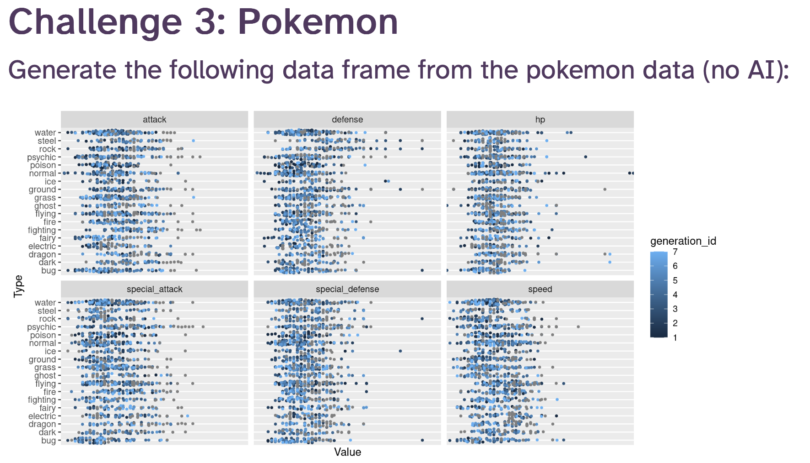
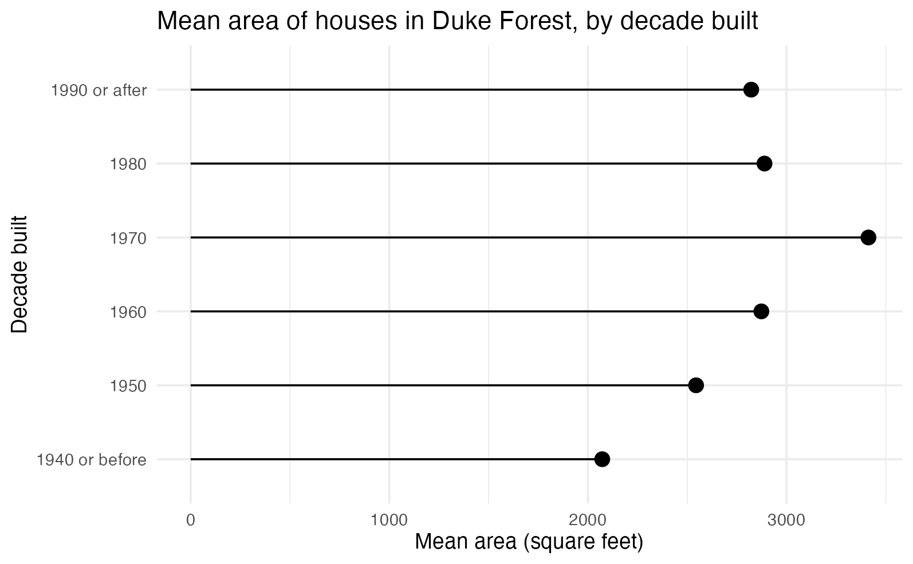
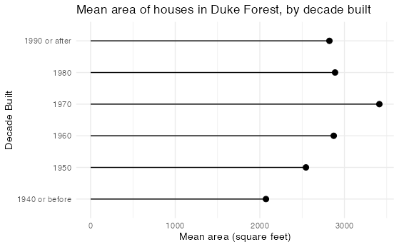

# Day 3 — Plot Code and Result Side-by-Side

## Challenge 3 - Pokemon Statistics
<table>
<tr><td>
    <h3>My Code (Condensed)</h3>
    See <code>./Challenge-3.R</code> for better analysis.

```R
# Challenge 3: Pokemon

# Create the Plot
p <- tuesdata$pokemon |>
  pivot_longer(
    cols = all_of(cols),
    names_to = "stat",
    values_to = "value"
  ) |>
  ggplot(aes(x = value, y = type_1, color = generation_id)) +
  geom_jitter(height = 0.20, alpha = 0.6, size = 1) +
  facet_wrap(~stat, ncol = 3, scales = "free_x") +
  labs(
    title = "Pokemon stats by Type",
    x = "Value",
    y = "Type"
  ) +
  theme_light() +
  theme(legend.position = "right")

p
```
</td><td>
    <h3>Reference Image</h3>
  
      <h3>My Submission</h3>
  
</td>
  </tr>
</table>

## Extra Challenge (Optional) - Duke Forest
<table>
<tr><td>
    <h3>My Code (Condensed)</h3>
    See <code>./Extra-Challenge.R</code> for better analysis.

```R
# Extra Challenge: Duke Forest
data <- data %>%
  mutate(decade = 
  case_when(
    (year_built >= 1990) ~ '1990 or after',
    (year_built >= 1980 & year_built < 1990) ~ '1980',
    (year_built >= 1970 & year_built < 1980) ~ '1970',
    (year_built >= 1960 & year_built < 1970) ~ '1960',
    (year_built >= 1950 & year_built < 1960) ~ '1950',
    (year_built < 1950) ~ "1940 or before"))
# Get Means
means <- data %>%
  group_by(decade) %>%
  summarise(mean_area = mean(area, na.rm = TRUE))

# Plot the Data
ggplot(means, aes(y = decade, x = mean_area)) +
  geom_segment(
    aes(yend = decade, x = 0, xend = mean_area),
    linewidth = 0.5,
    color = "black"
  ) +

  geom_point(size = 2.5, color = "black") +

  labs(
    title = "Mean area of houses in Duke Forest, by decade built",
    x = "Mean area (square feet)",
    y = "Decade Built"
  ) +
  theme_minimal()
```
</td><td>
    <h3>Reference Image</h3>
  
      <h3>My Submission</h3>
  
</td>
  </tr>
</table>

