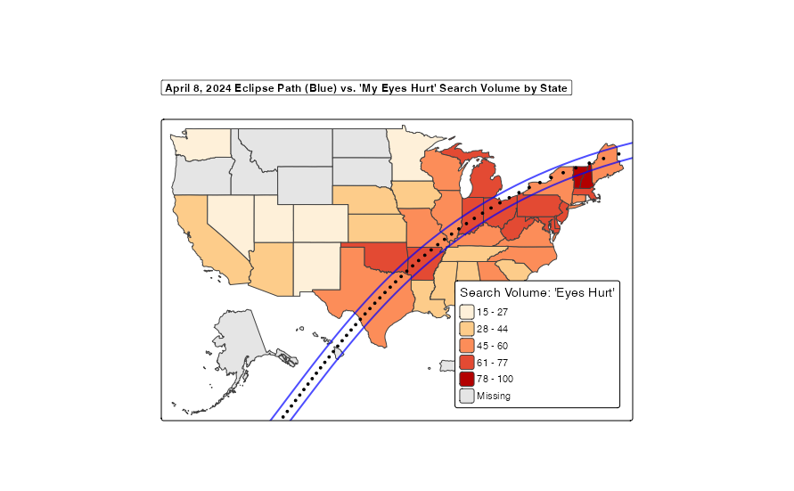

# Identifying Trends in Eye Pain on April 4th, 2024 using Geospatial Analysis 

## Overview
This project aims to analyze and visualize trends in eye pain reported on April 4th, 2024, the day of a total lunar eclipse. By leveraging geospatial analysis techniques, we will identify patterns and hotspots of eye pain accross the american states, with the hopes of understanding any correlations with environmental factors or the eclipse event itself.

## Data Collection
The data for this analysis was collected from various sources, including:

 - [Google Trends](https://trends.google.com/home): This is the main source of data, providing insights into search interest for the terms "eye pain", "eye discomfort", and related queries on April 8th, 2024.
 - [US Census Bureau](https://www.census.gov/geographies/mapping-files/time-series/geo/carto-boundary-file.html): This source provides the geographical boundaries of US states for mapping purposes.
 - [NASA](https://eclipse.gsfc.nasa.gov/SEpath/SEpath2001/SE2024Apr08Tpath.html): This source provides information about the lunar eclipse path and timing for our graphic overlay.

